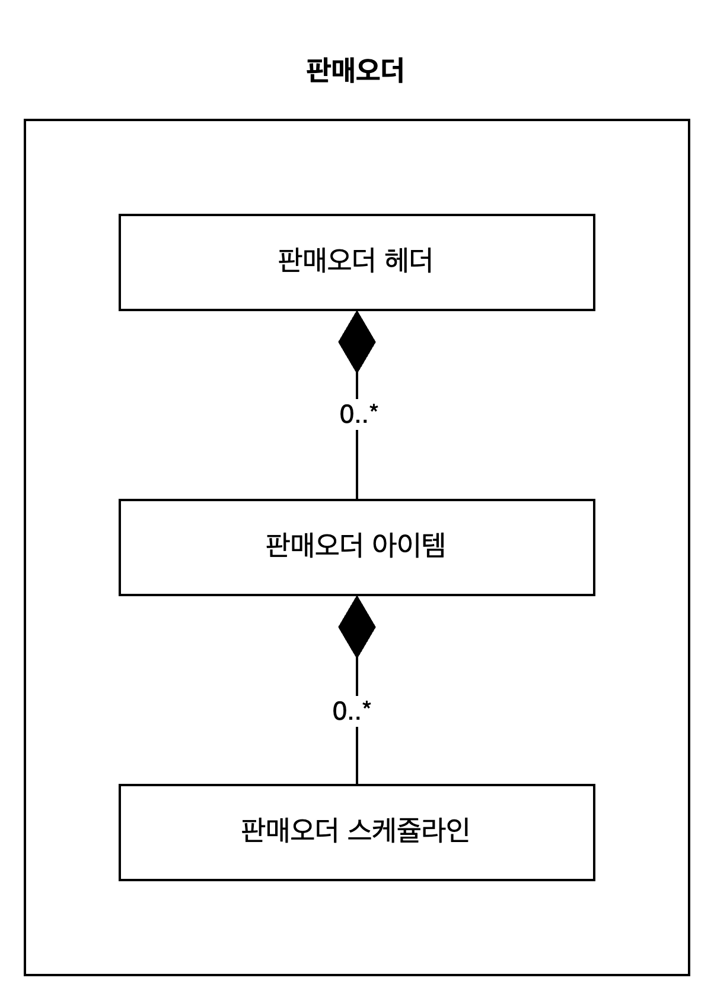

# Content01-Modeling Your First CDS View

  

테이블의 고정된 설계를 적절한 데이터 모델로 유연하게 변환하여 효율적인 어플리케이션 구축 가능

CDS뷰는 HANA 데이터베이스뷰로 생성 되며 ABAP에서 CDS뷰를 이용할 때 실행이 되게 된다.

* * *

  

## 1.1 기본적인 어플리케이션 데이터 모델을 선언하기

  

### **1.1.1 디자인 단계**

  

설계시에는

- 모델링을 하기 해서는 데이터 저장 부터 화면까지 모든 수준을 고려해야 한다.
- 모델링을 충분히 고려하지 않고 구현하게 되면 나중에 오히려 수정하는 비용이 많이 들게 된다.

  

### 1.1.2 모델링방법예시 - 판매오더

  

### 정의

먼저 판매오더는 판매오더하나에 여러개의 판매아이템이 있으며 판매아이템은 여러개의 주문일정라인을 가질 수 있다.

- 가진다는 가지는 주체가 삭제가 되면 종속되어 있는 항목들도 삭제가 되어야 한다는 의미 → Composition
- 판매오더 하나는 없거나 여러개의 아이템을 가질 수 있다 → 0..\* Composition
- 판매아이템 하나는 없거나 여러개의 스케쥴라인을 가질 수 있다 → 0..\* Composition

  

위의 항목을 가지고 모델링을 하면 다음과 같다.

  

  

판매오더헤더 하나는 없거나 하나의 판매조직과 고객관 관련이 되어 있다

- 관련이 되어 있다 → Association
- 판매오더 하나는 없거나 하나의 판매조직과 관련 → 0..1 Association
- 판매오더 하나는 없거나 하나의 고객과 관련 → 0..1 Association

  

  

판매오더아이템 하나는 없거나 하나의 제품과 관련이 되어 있으며, 제품은 없거나 여러언어의 텍스트 정보를 가지고 있다.

- 판매오더아이템 하나는 없거나 하나의 제품과 관련 → 0..1 Association
- 제품 하나는 없거나 여러개의 제품텍스트를 가질수 있다 → 0..\* Composition

  

  

Cardinality는 하나의 항목에 대해서 관련된 항목이 몇 개가 있는지를 나타내는 지표이며, 기준이 되는 항목의 데이터 한건에 대해서 라는 전제를 가지고 생각해야 한다.

- 0..1은 “기준이 되는 항목 하나에 대해서 관련 항목이 없거나 한개가 있을 수 있다” 라는 의미이다

  

위의 모델링 기준으로 다음 기준으로 CDS뷰 객체를 다음과 같이 정의한다.

  

  

### 구현

  

### **1) 테이블을 생성** 

  

eclipse를 이용해서 기존에 ABAP의 테이블을 생성할 수 있다.

패키지에서 오른쪽 클릭해서 나오는 context 메뉴에서 New → Other ABAP Repository Object를 선택한다.

  

  

검색필드에 TABLE을 입력하게 되면 Dictionary → Database Table을 선택하면 된다.

  

  

테이블명과 데이블 Description을 입력하고 “Next”를 클릭한다.

  

  

Requst를 할당한다. 없는 경우에는 새로운 Request를 만들어서 할당한다.

  

  

테이블의 필드를 입력하고 활성화를 한다.

```
@EndUserText.label : '판매조직'
@AbapCatalog.enhancement.category : #NOT_EXTENSIBLE
@AbapCatalog.tableCategory : #TRANSPARENT
@AbapCatalog.deliveryClass : #A
@AbapCatalog.dataMaintenance : #RESTRICTED
define table ztsd0020 {
  key client               : abap.clnt not null;
  key keysalesorganization : sysuuid_x16 not null;
  salesorganization        : vkorg not null;
  createdby                : abp_creation_user;
  createdat                : abp_creation_tstmpl;
  locallastchangedby       : abp_locinst_lastchange_user;
  locallastchangedat       : abp_locinst_lastchange_tstmpl;
  lastchangedby            : abp_lastchange_user;
  lastchangedat            : abp_lastchange_tstmpl;

}
```

  

위와같은 순서로 필요한 테이블을 다음과 같이 생성한다.

  

**ZTSD0010 : 판매오더 헤더**

```
@EndUserText.label : '판매오더 헤더'
@AbapCatalog.enhancement.category : #NOT_EXTENSIBLE
@AbapCatalog.tableCategory : #TRANSPARENT
@AbapCatalog.deliveryClass : #A
@AbapCatalog.dataMaintenance : #RESTRICTED
define table ztsd0010 {
  key client           : abap.clnt not null;
  key salesorderid     : sysuuid_x16 not null;
  salesorder           : vbeln not null;
  salesordertype       : auart;
  soldtopartyid        : sysuuid_x16;
  salesorganizationid  : sysuuid_x16;
  distributionchannel  : vtweg;
  organizationdivision : spart;
  @Semantics.amount.currencyCode : 'ztsd0010.transactioncurrency'
  netamount            : netwr_ap;
  transactioncurrency  : waerk;
  deliverystatus       : lfstk;
  deletionindicator    : loekz;
  createdby            : abp_creation_user;
  createdat            : abp_creation_tstmpl;
  locallastchangedby   : abp_locinst_lastchange_user;
  locallastchangedat   : abp_locinst_lastchange_tstmpl;
  lastchangedby        : abp_lastchange_user;
  lastchangedat        : abp_lastchange_tstmpl;

}
```

  

**ZTSD0011 : 판매오더 아이템**

```
@EndUserText.label : '판매오더 아이템'
@AbapCatalog.enhancement.category : #NOT_EXTENSIBLE
@AbapCatalog.tableCategory : #TRANSPARENT
@AbapCatalog.deliveryClass : #A
@AbapCatalog.dataMaintenance : #RESTRICTED
define table ztsd0011 {
  key client           : abap.clnt not null;
  key salesorderitemid : sysuuid_x16 not null;
  salesorderid         : sysuuid_x16;
  salesorderitem       : posnr not null;
  productid            : sysuuid_x16;
  @Semantics.quantity.unitOfMeasure : 'ztsd0011.orderquantityunit'
  orderquantity        : kwmeng;
  orderquantityunit    : vrkme;
  @Semantics.amount.currencyCode : 'ztsd0011.transactioncurrency'
  netamount            : netwr_ap;
  transactioncurrency  : waerk;
  createdby            : abp_creation_user;
  createdat            : abp_creation_tstmpl;
  locallastchangedby   : abp_locinst_lastchange_user;
  locallastchangedat   : abp_locinst_lastchange_tstmpl;
  lastchangedby        : abp_lastchange_user;
  lastchangedat        : abp_lastchange_tstmpl;

}
```

  

**ZTSD0012 : 판매오더 스케줄라인**

```
@EndUserText.label : '판매오더 스케쥴라인'
@AbapCatalog.enhancement.category : #NOT_EXTENSIBLE
@AbapCatalog.tableCategory : #TRANSPARENT
@AbapCatalog.deliveryClass : #A
@AbapCatalog.dataMaintenance : #RESTRICTED
define table ztsd0012 {
  key client                 : abap.clnt not null;
  key salesorderscheduleid   : sysuuid_x16 not null;
  salesorderitemid           : sysuuid_x16 not null;
  salesorderscheduleline     : etenr not null;
  @Semantics.quantity.unitOfMeasure : 'ztsd0012.orderquantityunit'
  orderquantity              : wmeng;
  orderquantityunit          : vrkme;
  deliverydate               : edatu;
  salesorderschedulelinetype : abap.char(1);
  createdby                  : abp_creation_user;
  createdat                  : abp_creation_tstmpl;
  locallastchangedby         : abp_locinst_lastchange_user;
  locallastchangedat         : abp_locinst_lastchange_tstmpl;
  lastchangedby              : abp_lastchange_user;
  lastchangedat              : abp_lastchange_tstmpl;

}
```

  

**ZTSD0020 : 판매조직**

```
@EndUserText.label : '판매조직'
@AbapCatalog.enhancement.category : #NOT_EXTENSIBLE
@AbapCatalog.tableCategory : #TRANSPARENT
@AbapCatalog.deliveryClass : #A
@AbapCatalog.dataMaintenance : #RESTRICTED
define table ztsd0020 {
  key client              : abap.clnt not null;
  key salesorganizatoinid : sysuuid_x16 not null;
  salesorganization       : vkorg not null;
  createdby               : abp_creation_user;
  createdat               : abp_creation_tstmpl;
  locallastchangedby      : abp_locinst_lastchange_user;
  locallastchangedat      : abp_locinst_lastchange_tstmpl;
  lastchangedby           : abp_lastchange_user;
  lastchangedat           : abp_lastchange_tstmpl;

}
```

  

**ZTSD0030 : 고객**

```
@EndUserText.label : '고객'
@AbapCatalog.enhancement.category : #NOT_EXTENSIBLE
@AbapCatalog.tableCategory : #TRANSPARENT
@AbapCatalog.deliveryClass : #A
@AbapCatalog.dataMaintenance : #RESTRICTED
define table ztsd0030 {
  key client         : abap.clnt not null;
  key customerid     : sysuuid_x16 not null;
  customer           : kunnr not null;
  name               : name1_gp;
  createdby          : abp_creation_user;
  createdat          : abp_creation_tstmpl;
  locallastchangedby : abp_locinst_lastchange_user;
  locallastchangedat : abp_locinst_lastchange_tstmpl;
  lastchangedby      : abp_lastchange_user;
  lastchangedat      : abp_lastchange_tstmpl;

}
```

  

**ZTSD0040 : 제품**

```
@EndUserText.label : '제품'
@AbapCatalog.enhancement.category : #NOT_EXTENSIBLE
@AbapCatalog.tableCategory : #TRANSPARENT
@AbapCatalog.deliveryClass : #A
@AbapCatalog.dataMaintenance : #RESTRICTED
define table ztsd0040 {
  key client         : abap.clnt not null;
  key productid      : sysuuid_x16 not null;
  product            : matnr not null;
  producttype        : mtart;
  authorizationgroup : begru;
  createdby          : abp_creation_user;
  createdat          : abp_creation_tstmpl;
  locallastchangedby : abp_locinst_lastchange_user;
  locallastchangedat : abp_locinst_lastchange_tstmpl;
  lastchangedby      : abp_lastchange_user;
  lastchangedat      : abp_lastchange_tstmpl;

}
```

  

#### **ZTSD0041 : 제품명**

```
@EndUserText.label : '제품명'
@AbapCatalog.enhancement.category : #NOT_EXTENSIBLE
@AbapCatalog.tableCategory : #TRANSPARENT
@AbapCatalog.deliveryClass : #A
@AbapCatalog.dataMaintenance : #RESTRICTED
define table ztsd0041 {
  key client         : abap.clnt not null;
  key producttextid  : sysuuid_x16 not null;
  productid          : sysuuid_x16;
  language           : langu not null;
  productname        : maktx;
  createdby          : abp_creation_user;
  createdat          : abp_creation_tstmpl;
  locallastchangedby : abp_locinst_lastchange_user;
  locallastchangedat : abp_locinst_lastchange_tstmpl;
  lastchangedby      : abp_lastchange_user;
  lastchangedat      : abp_lastchange_tstmpl;

}
```

  

  

### **2) CDS 뷰 생성**

  

**(작업예시)**

  

신규 개발 오브젝트 화면에서 DATA DEFINITION을 검색하여 “Data Definition”을 선택한다.

  

  

생성하고자 하는 CDS뷰의 이름과 내역 그리고 참조할 객체 (테이블 또는 다른 CDS뷰)가 있는 경우에 해당 객체를 입력한다.

  

  

Request를 입력하고 Next 버튼을 누른다. Finish 버튼을 눌러서 종료할 수 있지만 원하지 않는 타입의 CDS뷰가 생성이 될 수 있으므로 Next를 눌러서 생성하고자 하는 CDS 유형을 선택하는 것이 좋다.

  

  

원하는 CDS 템플릿을 선택하고 Finish 버튼을 선택한다.

  

  

CDS뷰의 필드명을 사용자가 알기 쉬운 단어로 Naming 한다. 단어간 구별을 위해서 Camelcase로 작성한다.

  

  

수량/금액 필드가 있는 경우에 semantic annotation을 추가한다.

- @Semantics.amount.currencyCode: ‘\[Currency 필드\]’
- @Semantics.quantity.unitOfMeasure: ‘\[Unit 필드\]’

  

  

다음으로 기본적인 필드의 라벨 정보를 입력해 준다. 

- 반드시 라벨은 실 사용하는 텍스트 정보로 모델링 시에 설정해야 한다.

```
@AbapCatalog.viewEnhancementCategory: [#NONE]
@AccessControl.authorizationCheck: #NOT_REQUIRED
@EndUserText.label: '판매오더 헤더'
@Metadata.ignorePropagatedAnnotations: true
@ObjectModel.usageType:{
  serviceQuality: #X,
  sizeCategory: #S,
  dataClass: #MIXED
}
define view entity ZSD_I_SALESORDER
  as select from ztsd0010
{
      @EndUserText.label: '판매오더키'
      @EndUserText.quickInfo: '판매오더키'
  key salesorderid         as SalesOrderId,

      @EndUserText.label: '판매오더'
      @EndUserText.quickInfo: '판매오더'
      salesorder           as SalesOrder,

      @EndUserText.label: '판매오더유형'
      @EndUserText.quickInfo: '판매오더유형'
      salesordertype       as SalesOrderType,

      @EndUserText.label: '판매처키'
      @EndUserText.quickInfo: '판매처키'
      soldtopartyid        as SoldToPartyId,

      @EndUserText.label: '판매조직키'
      @EndUserText.quickInfo: '판매조직키'
      salesorganizationid  as SalesOrganizationId,

      @EndUserText.label: '유통체널'
      @EndUserText.quickInfo: '유통체널'
      distributionchannel  as DistributionChannel,

      @EndUserText.label: '제품군'
      @EndUserText.quickInfo: '제품군'
      organizationdivision as OrganizationDivision,

      @EndUserText.label: '가격'
      @EndUserText.quickInfo: '가격'
      @Semantics.amount.currencyCode: 'TransactionCurrency'
      netamount            as Netamount,

      @EndUserText.label: '통화'
      @EndUserText.quickInfo: '통화'
      transactioncurrency  as TransactionCurrency,
      
      @EndUserText.label: '납품상태'
      @EndUserText.quickInfo: '납품상태'
      deliverystatus       as DeliveryStatus,

      @EndUserText.label: '삭제여부'
      @EndUserText.quickInfo: '삭제여부'
      deletionindicator    as DeletionIndicator,

      @EndUserText.label: '생성자'
      @EndUserText.quickInfo: '생성자'
      createdby            as CreatedBy,

      @EndUserText.label: '생성시간'
      @EndUserText.quickInfo: '생성시간'
      createdat            as CreatedAt,

      @EndUserText.label: '임시변경자'
      @EndUserText.quickInfo: '임시변경자'
      locallastchangedby   as LocalLastchangedBy,

      @EndUserText.label: '임시변경시간'
      @EndUserText.quickInfo: '임시변경시간'
      locallastchangedat   as LocalLastchangeDat,

      @EndUserText.label: '변경자'
      @EndUserText.quickInfo: '변경자'
      lastchangedby        as LastChangedBy,

      @EndUserText.label: '변경시간'
      @EndUserText.quickInfo: '변경시간'
      lastchangedat        as LastChangedAt
}
```

  

**이력정보**에 대한 Annotation을 추가한다.

- Business Object에서 사용되는 경우에 자동으로 해당 정보를 업데이트 하는데 사용된다

  

  

Activation을 수행한다. Activation을 수행하면 다음의 두개의 이관가능한 개발 오브젝트가 생성이 된다.

- **DDLS** : 소스코드에 정의된 CDS모델을 이관하기 위한 컨테이너
- **STOB** : 모델링 정보와 ABAP와 SAP HANA의 데이터소스 정보

  

생성된 CDS View소스에서 오른쪽 클릭을 하게 되면 “**Show SQL CREATE Statement**”를 통해서 실제 HANA DB에서 생성이 되는 뷰 생성 구문을 확인할 수 있다.

  

  

  

나머지 CDS뷰를 다음과 같이 작성한다.

  

**ZSD\_I\_SALESORDER : 판매오더 헤더**  

```
@AbapCatalog.viewEnhancementCategory: [#NONE]
@AccessControl.authorizationCheck: #NOT_REQUIRED
@EndUserText.label: '판매오더 헤더'
@Metadata.ignorePropagatedAnnotations: true
@ObjectModel.usageType:{
  serviceQuality: #X,
  sizeCategory: #S,
  dataClass: #MIXED
}
define view entity ZSD_I_SALESORDER
  as select from ztsd0010
{
      @EndUserText.label: '판매오더키'
      @EndUserText.quickInfo: '판매오더키'
  key salesorderid         as SalesOrderId,

      @EndUserText.label: '판매오더'
      @EndUserText.quickInfo: '판매오더'
      salesorder           as SalesOrder,

      @EndUserText.label: '판매오더유형'
      @EndUserText.quickInfo: '판매오더유형'
      salesordertype       as SalesOrderType,

      @EndUserText.label: '판매처키'
      @EndUserText.quickInfo: '판매처키'
      soldtopartyid        as SoldToPartyId,

      @EndUserText.label: '판매조직키'
      @EndUserText.quickInfo: '판매조직키'
      salesorganizationid  as SalesOrganizationId,

      @EndUserText.label: '유통체널'
      @EndUserText.quickInfo: '유통체널'
      distributionchannel  as DistributionChannel,

      @EndUserText.label: '제품군'
      @EndUserText.quickInfo: '제품군'
      organizationdivision as OrganizationDivision,

      @EndUserText.label: '가격'
      @EndUserText.quickInfo: '가격'
      @Semantics.amount.currencyCode: 'TransactionCurrency'
      netamount            as Netamount,

      @EndUserText.label: '통화'
      @EndUserText.quickInfo: '통화'
      transactioncurrency  as TransactionCurrency,

      @EndUserText.label: '납품상태'
      @EndUserText.quickInfo: '납품상태'
      deliverystatus       as DeliveryStatus,

      @EndUserText.label: '삭제여부'
      @EndUserText.quickInfo: '삭제여부'
      deletionindicator    as DeletionIndicator,

      @Semantics.user.createdBy: true
      @EndUserText.label: '생성자'
      @EndUserText.quickInfo: '생성자'
      createdby            as CreatedBy,

      @Semantics.systemDateTime.createdAt: true
      @EndUserText.label: '생성시간'
      @EndUserText.quickInfo: '생성시간'
      createdat            as CreatedAt,

      @Semantics.user.localInstanceLastChangedBy: true
      @EndUserText.label: '임시변경자'
      @EndUserText.quickInfo: '임시변경자'
      locallastchangedby   as LocalLastchangedBy,

      @Semantics.systemDateTime.localInstanceLastChangedAt: true
      @EndUserText.label: '임시변경시간'
      @EndUserText.quickInfo: '임시변경시간'
      locallastchangedat   as LocalLastchangeDat,

      @Semantics.systemDateTime.lastChangedAt: true
      @EndUserText.label: '변경자'
      @EndUserText.quickInfo: '변경자'
      lastchangedby        as LastChangedBy,

      @Semantics.user.lastChangedBy: true
      @EndUserText.label: '변경시간'
      @EndUserText.quickInfo: '변경시간'
      lastchangedat        as LastChangedAt
}
```

  

**ZSD\_I\_SALESORDERITEM : 판매오더 아이템**

```
@AbapCatalog.viewEnhancementCategory: [#NONE]
@AccessControl.authorizationCheck: #NOT_REQUIRED
@EndUserText.label: '판매오더 아이템'
@Metadata.ignorePropagatedAnnotations: true
@ObjectModel.usageType:{
  serviceQuality: #X,
  sizeCategory: #S,
  dataClass: #MIXED
}
define view entity ZSD_I_SALESORDERITEM
  as select from ztsd0011
{
      @EndUserText.label: '판매오더아이템키'
      @EndUserText.quickInfo: '판매오더아이템키'
  key salesorderitemid    as SalesOrderItemId,

      @EndUserText.label: '판매오더키'
      @EndUserText.quickInfo: '판매오더키'
      salesorderid        as SalesOrderId,

      @EndUserText.label: '아이템순번'
      @EndUserText.quickInfo: '아이템순번'
      salesorderitem      as SalesOrderItem,

      @EndUserText.label: '제품키'
      @EndUserText.quickInfo: '제품키'
      productid           as ProductId,

      @EndUserText.label: '수량'
      @EndUserText.quickInfo: '수량'
      @Semantics.quantity.unitOfMeasure: 'OrderQuantityUnit'
      orderquantity       as OrderQuantity,

      @EndUserText.label: '단위'
      @EndUserText.quickInfo: '단위'
      orderquantityunit   as OrderQuantityUnit,

      @EndUserText.label: '가격'
      @EndUserText.quickInfo: '가격'
      @Semantics.amount.currencyCode: 'TransactionCurrency'
      netamount           as NetAmount,

      @EndUserText.label: '통화'
      @EndUserText.quickInfo: '통화'
      transactioncurrency as TransactionCurrency,

      @Semantics.user.createdBy: true
      @EndUserText.label: '생성자'
      @EndUserText.quickInfo: '생성자'
      createdby           as CreatedBy,

      @Semantics.systemDateTime.createdAt: true
      @EndUserText.label: '생성시간'
      @EndUserText.quickInfo: '생성시간'
      createdat           as CreatedAt,

      @Semantics.user.localInstanceLastChangedBy: true
      @EndUserText.label: '임시변경자'
      @EndUserText.quickInfo: '임시변경자'
      locallastchangedby  as LocalLastchangedBy,

      @Semantics.systemDateTime.localInstanceLastChangedAt: true
      @EndUserText.label: '임시변경시간'
      @EndUserText.quickInfo: '임시변경시간'
      locallastchangedat  as LocalLastchangeDat,

      @Semantics.systemDateTime.lastChangedAt: true
      @EndUserText.label: '변경자'
      @EndUserText.quickInfo: '변경자'
      lastchangedby       as LastChangedBy,

      @Semantics.user.lastChangedBy: true
      @EndUserText.label: '변경시간'
      @EndUserText.quickInfo: '변경시간'
      lastchangedat       as LastChangedAt
}
```

  

**ZSD\_I\_SALESORDERSCHEDULE : 판매오더 스케쥴라인**

```
@AbapCatalog.viewEnhancementCategory: [#NONE]
@AccessControl.authorizationCheck: #NOT_REQUIRED
@EndUserText.label: '판매오더 스케쥴라인'
@Metadata.ignorePropagatedAnnotations: true
@ObjectModel.usageType:{
  serviceQuality: #X,
  sizeCategory: #S,
  dataClass: #MIXED
}
define view entity ZSD_I_SALESORDERSCHEDULE
  as select from ztsd0012
{
      @EndUserText.label: '판매오더스케쥴키'
      @EndUserText.quickInfo: '판매오더스케쥴키'
  key salesorderscheduleid       as SalesOrderScheduleId,

      @EndUserText.label: '판매오더아이템키'
      @EndUserText.quickInfo: '판매오더아이템키'
      salesorderitemid           as SalesOrderItemId,

      @EndUserText.label: '아이템순번'
      @EndUserText.quickInfo: '아이템순번'
      salesorderscheduleline     as SalesOrderScheduleLine,

      @EndUserText.label: '수량'
      @EndUserText.quickInfo: '수량'
      @Semantics.quantity.unitOfMeasure: 'OrderQuantityUnit'
      orderquantity              as OrderQuantity,

      @EndUserText.label: '단위'
      @EndUserText.quickInfo: '단위'
      orderquantityunit          as OrderQuantityUnit,

      @EndUserText.label: '납품일'
      @EndUserText.quickInfo: '납품일'
      deliverydate               as DeliveryDate,

      @EndUserText.label: '스케쥴라인유형'
      @EndUserText.quickInfo: '스케쥴라인유형'
      salesorderschedulelinetype as Salesorderschedulelinetype,

      @Semantics.user.createdBy: true
      @EndUserText.label: '생성자'
      @EndUserText.quickInfo: '생성자'
      createdby                  as CreatedBy,

      @Semantics.systemDateTime.createdAt: true
      @EndUserText.label: '생성시간'
      @EndUserText.quickInfo: '생성시간'
      createdat                  as CreatedAt,

      @Semantics.user.localInstanceLastChangedBy: true
      @EndUserText.label: '임시변경자'
      @EndUserText.quickInfo: '임시변경자'
      locallastchangedby         as LocalLastchangedBy,

      @Semantics.systemDateTime.localInstanceLastChangedAt: true
      @EndUserText.label: '임시변경시간'
      @EndUserText.quickInfo: '임시변경시간'
      locallastchangedat         as LocalLastchangeDat,

      @Semantics.systemDateTime.lastChangedAt: true
      @EndUserText.label: '변경자'
      @EndUserText.quickInfo: '변경자'
      lastchangedby              as LastChangedBy,

      @Semantics.user.lastChangedBy: true
      @EndUserText.label: '변경시간'
      @EndUserText.quickInfo: '변경시간'
      lastchangedat              as LastChangedAt
}
```

  

**ZSD\_I\_SALESORGANIZATION : 판매조직**

```
@AbapCatalog.viewEnhancementCategory: [#NONE]
@AccessControl.authorizationCheck: #NOT_REQUIRED
@EndUserText.label: '판매조직'
@Metadata.ignorePropagatedAnnotations: true
@ObjectModel.usageType:{
  serviceQuality: #X,
  sizeCategory: #S,
  dataClass: #MIXED
}
define view entity ZSD_I_SALESORGANIZATION
  as select from ztsd0020
{
      @EndUserText.label: '판매조직키'
      @EndUserText.quickInfo: '판매조직키'
  key salesorganizatoinid as SalesOrganizationId,

      @EndUserText.label: '판매조직'
      @EndUserText.quickInfo: '판매조직'
      salesorganization   as SalesOrganization,

      @Semantics.user.createdBy: true
      @EndUserText.label: '생성자'
      @EndUserText.quickInfo: '생성자'
      createdby           as CreatedBy,

      @Semantics.systemDateTime.createdAt: true
      @EndUserText.label: '생성시간'
      @EndUserText.quickInfo: '생성시간'
      createdat           as CreatedAt,

      @Semantics.user.localInstanceLastChangedBy: true
      @EndUserText.label: '임시변경자'
      @EndUserText.quickInfo: '임시변경자'
      locallastchangedby  as LocalLastchangedBy,

      @Semantics.systemDateTime.localInstanceLastChangedAt: true
      @EndUserText.label: '임시변경시간'
      @EndUserText.quickInfo: '임시변경시간'
      locallastchangedat  as LocalLastchangeDat,

      @Semantics.systemDateTime.lastChangedAt: true
      @EndUserText.label: '변경자'
      @EndUserText.quickInfo: '변경자'
      lastchangedby       as LastChangedBy,

      @Semantics.user.lastChangedBy: true
      @EndUserText.label: '변경시간'
      @EndUserText.quickInfo: '변경시간'
      lastchangedat       as LastChangedAt
}
```

  

**ZSD\_I\_CUSTOMER : 고객**

```
@AbapCatalog.viewEnhancementCategory: [#NONE]
@AccessControl.authorizationCheck: #NOT_REQUIRED
@EndUserText.label: '고객'
@Metadata.ignorePropagatedAnnotations: true
@ObjectModel.usageType:{
  serviceQuality: #X,
  sizeCategory: #S,
  dataClass: #MIXED
}
define view entity ZSD_I_CUSTOMER
  as select from ztsd0030
{
      @EndUserText.label: '고객키'
      @EndUserText.quickInfo: '고객키'
  key customerid         as CustomerId,

      @EndUserText.label: '고객번호'
      @EndUserText.quickInfo: '고객번호'
      customer           as Customer,

      @EndUserText.label: '고객명'
      @EndUserText.quickInfo: '고객명'
      name               as Name,

      @Semantics.user.createdBy: true
      @EndUserText.label: '생성자'
      @EndUserText.quickInfo: '생성자'
      createdby          as CreatedBy,

      @Semantics.systemDateTime.createdAt: true
      @EndUserText.label: '생성시간'
      @EndUserText.quickInfo: '생성시간'
      createdat          as CreatedAt,

      @Semantics.user.localInstanceLastChangedBy: true
      @EndUserText.label: '임시변경자'
      @EndUserText.quickInfo: '임시변경자'
      locallastchangedby as LocalLastchangedBy,

      @Semantics.systemDateTime.localInstanceLastChangedAt: true
      @EndUserText.label: '임시변경시간'
      @EndUserText.quickInfo: '임시변경시간'
      locallastchangedat as LocalLastchangeDat,

      @Semantics.systemDateTime.lastChangedAt: true
      @EndUserText.label: '변경자'
      @EndUserText.quickInfo: '변경자'
      lastchangedby      as LastChangedBy,

      @Semantics.user.lastChangedBy: true
      @EndUserText.label: '변경시간'
      @EndUserText.quickInfo: '변경시간'
      lastchangedat      as LastChangedAt
}
```

  

**ZSD\_I\_PRODUCT : 제품**

```
@AbapCatalog.viewEnhancementCategory: [#NONE]
@AccessControl.authorizationCheck: #NOT_REQUIRED
@EndUserText.label: '제품'
@Metadata.ignorePropagatedAnnotations: true
@ObjectModel.usageType:{
  serviceQuality: #X,
  sizeCategory: #S,
  dataClass: #MIXED
}
define view entity ZSD_I_PRODUCT
  as select from ztsd0040
{
      @EndUserText.label: '제품키'
      @EndUserText.quickInfo: '제품키'
  key productid              as ProductId,

      @EndUserText.label: '자재번호'
      @EndUserText.quickInfo: '자재번호'
      product            as Product,

      @EndUserText.label: '자재유형'
      @EndUserText.quickInfo: '자재유형'
      producttype        as ProductType,

      @EndUserText.label: '권한그룹'
      @EndUserText.quickInfo: '권한그룹'
      authorizationgroup as AuthorizationGroup,

      @Semantics.user.createdBy: true
      @EndUserText.label: '생성자'
      @EndUserText.quickInfo: '생성자'
      createdby          as CreatedBy,

      @Semantics.systemDateTime.createdAt: true
      @EndUserText.label: '생성시간'
      @EndUserText.quickInfo: '생성시간'
      createdat          as CreatedAt,

      @Semantics.user.localInstanceLastChangedBy: true
      @EndUserText.label: '임시변경자'
      @EndUserText.quickInfo: '임시변경자'
      locallastchangedby as LocalLastchangedBy,

      @Semantics.systemDateTime.localInstanceLastChangedAt: true
      @EndUserText.label: '임시변경시간'
      @EndUserText.quickInfo: '임시변경시간'
      locallastchangedat as LocalLastchangeDat,

      @Semantics.systemDateTime.lastChangedAt: true
      @EndUserText.label: '변경자'
      @EndUserText.quickInfo: '변경자'
      lastchangedby      as LastChangedBy,

      @Semantics.user.lastChangedBy: true
      @EndUserText.label: '변경시간'
      @EndUserText.quickInfo: '변경시간'
      lastchangedat      as LastChangedAt
}
```

  

**ZSD\_I\_PRODUCTTEXT : 제품명**

```
@AbapCatalog.viewEnhancementCategory: [#NONE]
@AccessControl.authorizationCheck: #NOT_REQUIRED
@EndUserText.label: '제품명'
@Metadata.ignorePropagatedAnnotations: true
@ObjectModel.usageType:{
  serviceQuality: #X,
  sizeCategory: #S,
  dataClass: #MIXED
}
define view entity ZSD_I_PRODUCTTEXT
  as select from ztsd0041
{
      @EndUserText.label: '제품명키'
      @EndUserText.quickInfo: '제품명키'
  key producttextid              as ProductTextId,

      @EndUserText.label: '제품키'
      @EndUserText.quickInfo: '제품키'
      productid            as ProductId,

      @EndUserText.label: '언어'
      @EndUserText.quickInfo: '언어'
      language           as Language,

      @EndUserText.label: '제품명'
      @EndUserText.quickInfo: '제품명'
      productname        as ProductName,

      @Semantics.user.createdBy: true
      @EndUserText.label: '생성자'
      @EndUserText.quickInfo: '생성자'
      createdby          as CreatedBy,

      @Semantics.systemDateTime.createdAt: true
      @EndUserText.label: '생성시간'
      @EndUserText.quickInfo: '생성시간'
      createdat          as CreatedAt,

      @Semantics.user.localInstanceLastChangedBy: true
      @EndUserText.label: '임시변경자'
      @EndUserText.quickInfo: '임시변경자'
      locallastchangedby as LocalLastchangedBy,

      @Semantics.systemDateTime.localInstanceLastChangedAt: true
      @EndUserText.label: '임시변경시간'
      @EndUserText.quickInfo: '임시변경시간'
      locallastchangedat as LocalLastchangeDat,

      @Semantics.systemDateTime.lastChangedAt: true
      @EndUserText.label: '변경자'
      @EndUserText.quickInfo: '변경자'
      lastchangedby      as LastChangedBy,

      @Semantics.user.lastChangedBy: true
      @EndUserText.label: '변경시간'
      @EndUserText.quickInfo: '변경시간'
      lastchangedat      as LastChangedAt
}
```

  

 **3****) CDS 간 관계 설정**

다음으로 엔터티간의 관계를 설정하는 Association 관계를 설정한다.

  

**(작업예시)**

판매오더아이템 데이터 하나는 제품 데이터 하나 또는 관계가 없는 0..1 의 관계를 가지는데 다음과 같이 작업을 수행하면 된다.

  

먼저 다음과 같이 판매오더 아이템에서 association 문법을 사용하여 두 데이터간의 관계를 설정한다.

  

위의 로직을 간단히 설명하면,

- Association도 하나의 CDS뷰의 필드로 취급하므로 \_로 시작하는 알기 쉬운 이름으로 설정해야 한다.
    - ex) \_Product
- $projection은 현 CDS뷰의 결과 필드를 말하며 여기서는 Product 필드를 의미한다.
- Association에는 관계에 대한 조건이 들어가야 하며, 되도록이면 키값을 통한 설정을 하는 게 좋다
    - 키값이 아닌 경우에는 중복데이터가 검색되는 경우가 생길 수 있다  
  

위와 같이 노란색 warning 표시가 나타나는데 해당 표시에 마우스를 올려 놓으면 다음과 같이 출력이 된다.

  

해당 경고를 간단히 설명하면,

- Association 필드인 \_Product를 해당 CDS뷰 내에서 사용하지 않았음을 의미
- 만일, 현재 CDS를 다른 CDS에서 사용하는 경우에는 \_Product의 정보를 가져다가 사용할 수 없다

  

따라서 다음과 같이 $projection 필드리스트에 해당 Association 필드도 추가해 준다.

  

  

위의 작업순서를 바탕으로 다른 CDS에도 Association 관계를 설정한다.

  

**ZSD\_I\_SALESORDER**  

- 고객과 0..1
- 판매조직과 0..1

```
@AbapCatalog.viewEnhancementCategory: [#NONE]
@AccessControl.authorizationCheck: #NOT_REQUIRED
@EndUserText.label: '판매오더 헤더'
@Metadata.ignorePropagatedAnnotations: true
@ObjectModel.usageType:{
  serviceQuality: #X,
  sizeCategory: #S,
  dataClass: #MIXED
}
define view entity ZSD_I_SALESORDER
  as select from ztsd0010
  association [0..1] to ZSD_I_CUSTOMER          as _SoldToParty       on $projection.SoldToPartyId = _SoldToParty.CustomerId
  association [0..1] to ZSD_I_SALESORGANIZATION as _SalesOrganization on $projection.SalesOrganizationId = _SalesOrganization.SalesOrganizationId
{
      @EndUserText.label: '판매오더키'
      @EndUserText.quickInfo: '판매오더키'
  key salesorderid         as SalesOrderId,

      @EndUserText.label: '판매오더'
      @EndUserText.quickInfo: '판매오더'
      salesorder           as SalesOrder,

      @EndUserText.label: '판매오더유형'
      @EndUserText.quickInfo: '판매오더유형'
      salesordertype       as SalesOrderType,

      @EndUserText.label: '판매처키'
      @EndUserText.quickInfo: '판매처키'
      soldtopartyid        as SoldToPartyId,

      @EndUserText.label: '판매조직키'
      @EndUserText.quickInfo: '판매조직키'
      salesorganizationid  as SalesOrganizationId,

      @EndUserText.label: '유통체널'
      @EndUserText.quickInfo: '유통체널'
      distributionchannel  as DistributionChannel,

      @EndUserText.label: '제품군'
      @EndUserText.quickInfo: '제품군'
      organizationdivision as OrganizationDivision,

      @EndUserText.label: '가격'
      @EndUserText.quickInfo: '가격'
      @Semantics.amount.currencyCode: 'TransactionCurrency'
      netamount            as Netamount,

      @EndUserText.label: '통화'
      @EndUserText.quickInfo: '통화'
      transactioncurrency  as TransactionCurrency,

      @EndUserText.label: '납품상태'
      @EndUserText.quickInfo: '납품상태'
      deliverystatus       as DeliveryStatus,

      @EndUserText.label: '삭제여부'
      @EndUserText.quickInfo: '삭제여부'
      deletionindicator    as DeletionIndicator,

      @Semantics.user.createdBy: true
      @EndUserText.label: '생성자'
      @EndUserText.quickInfo: '생성자'
      createdby            as CreatedBy,

      @Semantics.systemDateTime.createdAt: true
      @EndUserText.label: '생성시간'
      @EndUserText.quickInfo: '생성시간'
      createdat            as CreatedAt,

      @Semantics.user.localInstanceLastChangedBy: true
      @EndUserText.label: '임시변경자'
      @EndUserText.quickInfo: '임시변경자'
      locallastchangedby   as LocalLastchangedBy,

      @Semantics.systemDateTime.localInstanceLastChangedAt: true
      @EndUserText.label: '임시변경시간'
      @EndUserText.quickInfo: '임시변경시간'
      locallastchangedat   as LocalLastchangeDat,

      @Semantics.systemDateTime.lastChangedAt: true
      @EndUserText.label: '변경자'
      @EndUserText.quickInfo: '변경자'
      lastchangedby        as LastChangedBy,

      @Semantics.user.lastChangedBy: true
      @EndUserText.label: '변경시간'
      @EndUserText.quickInfo: '변경시간'
      lastchangedat        as LastChangedAt,

      // Associations
      _SoldToParty,

      _SalesOrganization
}
```

  

**ZSD\_I\_SALESORDERITEM**  

- 제품과 0..1

```
@AbapCatalog.viewEnhancementCategory: [#NONE]
@AccessControl.authorizationCheck: #NOT_REQUIRED
@EndUserText.label: '판매오더 아이템'
@Metadata.ignorePropagatedAnnotations: true
@ObjectModel.usageType:{
  serviceQuality: #X,
  sizeCategory: #S,
  dataClass: #MIXED
}
define view entity ZSD_I_SALESORDERITEM
  as select from ztsd0011
  association [0..1] to ZSD_I_PRODUCT as _Product on $projection.ProductId = _Product.ProductId
{
      @EndUserText.label: '판매오더아이템키'
      @EndUserText.quickInfo: '판매오더아이템키'
  key salesorderitemid    as SalesOrderItemId,

      @EndUserText.label: '판매오더키'
      @EndUserText.quickInfo: '판매오더키'
      salesorderid        as SalesOrderId,

      @EndUserText.label: '아이템순번'
      @EndUserText.quickInfo: '아이템순번'
      salesorderitem      as SalesOrderItem,

      @EndUserText.label: '제품키'
      @EndUserText.quickInfo: '제품키'
      productid           as ProductId,

      @EndUserText.label: '수량'
      @EndUserText.quickInfo: '수량'
      @Semantics.quantity.unitOfMeasure: 'OrderQuantityUnit'
      orderquantity       as OrderQuantity,

      @EndUserText.label: '단위'
      @EndUserText.quickInfo: '단위'
      orderquantityunit   as OrderQuantityUnit,

      @EndUserText.label: '가격'
      @EndUserText.quickInfo: '가격'
      @Semantics.amount.currencyCode: 'TransactionCurrency'
      netamount           as NetAmount,

      @EndUserText.label: '통화'
      @EndUserText.quickInfo: '통화'
      transactioncurrency as TransactionCurrency,

      @Semantics.user.createdBy: true
      @EndUserText.label: '생성자'
      @EndUserText.quickInfo: '생성자'
      createdby           as CreatedBy,

      @Semantics.systemDateTime.createdAt: true
      @EndUserText.label: '생성시간'
      @EndUserText.quickInfo: '생성시간'
      createdat           as CreatedAt,

      @Semantics.user.localInstanceLastChangedBy: true
      @EndUserText.label: '임시변경자'
      @EndUserText.quickInfo: '임시변경자'
      locallastchangedby  as LocalLastchangedBy,

      @Semantics.systemDateTime.localInstanceLastChangedAt: true
      @EndUserText.label: '임시변경시간'
      @EndUserText.quickInfo: '임시변경시간'
      locallastchangedat  as LocalLastchangeDat,

      @Semantics.systemDateTime.lastChangedAt: true
      @EndUserText.label: '변경자'
      @EndUserText.quickInfo: '변경자'
      lastchangedby       as LastChangedBy,

      @Semantics.user.lastChangedBy: true
      @EndUserText.label: '변경시간'
      @EndUserText.quickInfo: '변경시간'
      lastchangedat       as LastChangedAt,
      
      // Associations
      _Product
}
```

  

테스트를 하기위해서 ABAP Report를 다음과 같이 만들어 테이블의 값을 입력한다.

```
*&---------------------------------------------------------------------*
*& Report zsd_cds01
*&---------------------------------------------------------------------*
*&
*&---------------------------------------------------------------------*
REPORT zsd_cds01.

SELECTION-SCREEN BEGIN OF BLOCK b0 WITH FRAME.
  PARAMETERS : p_cr TYPE xfeld RADIOBUTTON GROUP rg1 DEFAULT 'X'.
  PARAMETERS : p_dt TYPE xfeld RADIOBUTTON GROUP rg1.
SELECTION-SCREEN END OF BLOCK b0.

SELECTION-SCREEN BEGIN OF BLOCK b1 WITH FRAME.
  PARAMETERS : p_prefix TYPE c LENGTH 2 DEFAULT 'T1' OBLIGATORY.
  PARAMETERS : p_ocnt   TYPE i DEFAULT 5.   "판매조직  MAX 9
  PARAMETERS : p_ccnt   TYPE i DEFAULT 10.  "고객     MAX 10000
  PARAMETERS : p_pcnt   TYPE i DEFAULT 10.  "제품     MAX 10000
  PARAMETERS : p_scnt   TYPE i DEFAULT 100. "판매오더  MAX 10000
  PARAMETERS : p_icnt   TYPE i DEFAULT 1.   "판매오더아이템최대 MAX 100
  PARAMETERS : p_dcnt   TYPE i DEFAULT 1.   "스케쥴라인최대    MAX 5
SELECTION-SCREEN END OF BLOCK b1.

START-OF-SELECTION.

  DATA : lv_answer TYPE c LENGTH 1.

  IF p_dt IS NOT INITIAL.
    CALL FUNCTION 'POPUP_TO_CONFIRM'
      EXPORTING
        titlebar      = '삭제'
        text_question = '기존데이터를 삭제하시겠습니까?'
        text_button_1 = 'Yes'
        text_button_2 = 'No'
      IMPORTING
        answer        = lv_answer.

    IF lv_answer = '1'.
      DELETE FROM ztsd0010.
      DELETE FROM ztsd0011.
      DELETE FROM ztsd0012.
      DELETE FROM ztsd0020.
      DELETE FROM ztsd0030.
      DELETE FROM ztsd0040.
      DELETE FROM ztsd0041.

      MESSAGE '성공적으로 삭제하였습니다.' TYPE 'S'.
    ENDIF.

    EXIT.
  ENDIF.

  DATA : lv_timestampl TYPE timestampl.

  GET TIME STAMP FIELD lv_timestampl.

  """"""""""""""""""""""""""""""""""""""""""""""""""""""""""""""""""""""
  " INITIALIZATION
  """"""""""""""""""""""""""""""""""""""""""""""""""""""""""""""""""""""
  DATA : ls_config       TYPE ztsd0000,
         lt_product      TYPE STANDARD TABLE OF ztsd0040,
         lt_product_text TYPE STANDARD TABLE OF ztsd0041,
         lt_salesorg     TYPE STANDARD TABLE OF ztsd0020,
         lt_customer     TYPE STANDARD TABLE OF ztsd0030,
         lt_salesorder_h TYPE STANDARD TABLE OF ztsd0010,
         lt_salesorder_i TYPE STANDARD TABLE OF ztsd0011,
         lt_salesorder_s TYPE STANDARD TABLE OF ztsd0012,
         lv_index        TYPE i.

  """"""""""""""""""""""""""""""""""""""""""""""""""""""""""""""""""""
  " CHECK
  """"""""""""""""""""""""""""""""""""""""""""""""""""""""""""""""""""
  IF p_ocnt >= 10    OR
     p_ccnt >= 10000 OR
     p_pcnt >= 10000 OR
     p_scnt >= 10000 OR
     p_icnt >= 100   OR
     p_dcnt >= 5.
    MESSAGE 'Large Data Generation forbidden.' TYPE 'E'.
  ENDIF.

  SELECT SINGLE *
  FROM ztsd0000
  INTO @DATA(ls_configuration)
  WHERE prefix = @p_prefix.

  IF sy-subrc = 0.
    MESSAGE '이미 생성된 템플릿데이터가 존재하는 Prefix입니다' TYPE 'E'.
  ENDIF.

  ls_config-prefix = p_prefix.

  """"""""""""""""""""""""""""""""""""""""""""""""""""""""""""""""""""
  " 제품
  """"""""""""""""""""""""""""""""""""""""""""""""""""""""""""""""""""
  CLEAR : lv_index.

  DO p_pcnt TIMES.
    lv_index += 1.

    APPEND INITIAL LINE TO lt_product[] ASSIGNING FIELD-SYMBOL(<fs_product>).
    <fs_product>-productid          = cl_uuid_factory=>create_system_uuid( )->create_uuid_x16( ).
    <fs_product>-product            = |P{ p_prefix }{ lv_index }|.
    <fs_product>-producttype        = |FERT|.
    <fs_product>-authorizationgroup = |A001|.
    <fs_product>-createdby          = sy-uname.
    <fs_product>-createdat          = lv_timestampl.
    <fs_product>-locallastchangedby = sy-uname.
    <fs_product>-locallastchangedat = lv_timestampl.
    <fs_product>-lastchangedby      = sy-uname.
    <fs_product>-lastchangedat      = lv_timestampl.

    DO 2 TIMES.
      APPEND INITIAL LINE TO lt_product_text[] ASSIGNING FIELD-SYMBOL(<fs_product_text>).
      <fs_product_text>-producttextid = cl_uuid_factory=>create_system_uuid( )->create_uuid_x16( ).
      <fs_product_text>-productid     = <fs_product>-productid.
      <fs_product_text>-productname   = |{ <fs_product>-product }_TEXT|.

      IF sy-index = 1.
        <fs_product_text>-language = '3'.
      ELSE.
        <fs_product_text>-language = 'E'.
      ENDIF.

      <fs_product_text>-createdby          = sy-uname.
      <fs_product_text>-createdat          = lv_timestampl.
      <fs_product_text>-locallastchangedby = sy-uname.
      <fs_product_text>-locallastchangedat = lv_timestampl.
      <fs_product_text>-lastchangedby      = sy-uname.
      <fs_product_text>-lastchangedat      = lv_timestampl.
    ENDDO.
  ENDDO.

  """"""""""""""""""""""""""""""""""""""""""""""""""""""""""""""""""""
  " 판매조직
  """"""""""""""""""""""""""""""""""""""""""""""""""""""""""""""""""""
  CLEAR : lv_index.

  DO p_ocnt TIMES.
    lv_index += 1.

    APPEND VALUE #(
      salesorganizatoinid = cl_uuid_factory=>create_system_uuid( )->create_uuid_x16( )
      salesorganization   = |S{ p_prefix }{ lv_index }|
      createdby           = sy-uname
      createdat           = lv_timestampl
      locallastchangedby  = sy-uname
      locallastchangedat  = lv_timestampl
      lastchangedby       = sy-uname
      lastchangedat       = lv_timestampl
    ) TO lt_salesorg.
  ENDDO.

  """"""""""""""""""""""""""""""""""""""""""""""""""""""""""""""""""""
  " 고객
  """"""""""""""""""""""""""""""""""""""""""""""""""""""""""""""""""""
  CLEAR : lv_index.

  DO p_ccnt TIMES.
    lv_index += 1.

    APPEND VALUE #(
      customerid          = cl_uuid_factory=>create_system_uuid( )->create_uuid_x16( )
      customer            = |C{ p_prefix }_{ lv_index }|
      name                = |C{ p_prefix }_{ lv_index }_NAME|
      createdby           = sy-uname
      createdat           = lv_timestampl
      locallastchangedby  = sy-uname
      locallastchangedat  = lv_timestampl
      lastchangedby       = sy-uname
      lastchangedat       = lv_timestampl
    ) TO lt_customer.
  ENDDO.

  """"""""""""""""""""""""""""""""""""""""""""""""""""""""""""""""""""
  " 판매오더
  """"""""""""""""""""""""""""""""""""""""""""""""""""""""""""""""""""
  DATA : lv_random_sot_max  TYPE cl_abap_random=>p31_0,
         lv_random_sot_min  TYPE cl_abap_random=>p31_0,
         lv_random_sot      TYPE i,
         lv_random_dis_max  TYPE cl_abap_random=>p31_0,
         lv_random_dis_min  TYPE cl_abap_random=>p31_0,
         lv_random_dis      TYPE i,
         lv_random_sdi_max  TYPE cl_abap_random=>p31_0,
         lv_random_sdi_min  TYPE cl_abap_random=>p31_0,
         lv_random_sdi      TYPE i,
         lv_random_dls_max  TYPE cl_abap_random=>p31_0,
         lv_random_dls_min  TYPE cl_abap_random=>p31_0,
         lv_random_dls      TYPE i,
         lv_random_slt_max  TYPE cl_abap_random=>p31_0,
         lv_random_slt_min  TYPE cl_abap_random=>p31_0,
         lv_random_slt      TYPE i,
         lv_random_cus_max  TYPE cl_abap_random=>p31_0,
         lv_random_cus_min  TYPE cl_abap_random=>p31_0,
         lv_random_cus      TYPE i,
         lv_random_sog_max  TYPE cl_abap_random=>p31_0,
         lv_random_sog_min  TYPE cl_abap_random=>p31_0,
         lv_random_sog      TYPE i,
         lv_random_prd_max  TYPE cl_abap_random=>p31_0,
         lv_random_prd_min  TYPE cl_abap_random=>p31_0,
         lv_random_prd      TYPE i,
         lv_random_sit_max  TYPE cl_abap_random=>p31_0,
         lv_random_sit_min  TYPE cl_abap_random=>p31_0,
         lv_random_sit      TYPE i,
         lv_random_sch_max  TYPE cl_abap_random=>p31_0,
         lv_random_sch_min  TYPE cl_abap_random=>p31_0,
         lv_random_sch      TYPE i,
         lv_amount          TYPE netwr_ap,
         lv_net_amount      TYPE netwr_ap,
         lv_quantity        TYPE kwmeng,
         lv_quantity_sch    TYPE kwmeng,
         lv_date_sch        TYPE sydatum,
         lt_delivery_status TYPE STANDARD TABLE OF lfstk,
         ls_salesorder_h    LIKE LINE OF lt_salesorder_h,
         ls_salesorder_i    LIKE LINE OF lt_salesorder_i,
         lv_salesorder_item TYPE posnr,
         lv_salesorder_sch  TYPE etenr,
         lt_sch_line_type   TYPE STANDARD TABLE OF char1.

  CLEAR : lv_index.

  lv_random_sot_max = 1.
  lv_random_sot_min = 1.
  lv_random_dis_max = 1.
  lv_random_dis_min = 1.
  lv_random_sdi_max = 1.
  lv_random_sdi_min = 1.
  lv_random_dls_max = 1.
  lv_random_dls_min = 1.
  lv_random_slt_max = 1.
  lv_random_slt_min = 1.
  lv_random_cus_max = 1.
  lv_random_cus_min = 1.
  lv_random_sog_max = 1.
  lv_random_sog_min = 1.
  lv_random_prd_max = 1.
  lv_random_prd_min = 1.
  lv_random_sit_min = 1.
  lv_random_sit_max = p_icnt.
  lv_random_sch_min = 1.
  lv_random_sch_max = p_dcnt.

  DATA(lo_random_sot)   = cl_abap_random=>create( ).
  DATA(lo_random_dis)   = cl_abap_random=>create( ).
  DATA(lo_random_sdi)   = cl_abap_random=>create( ).
  DATA(lo_random_dls)   = cl_abap_random=>create( ).
  DATA(lo_random_sit)   = cl_abap_random=>create( ).
  DATA(lo_random_sch)   = cl_abap_random=>create( ).
  DATA(lo_random_amt)   = cl_abap_random=>create( ).
  DATA(lo_random_qty)   = cl_abap_random=>create( ).
  DATA(lo_random_date)  = cl_abap_random=>create( ).
  DATA(lo_random_slt)   = cl_abap_random=>create( ).
  DATA(lo_random_prd)   = cl_abap_random=>create( ).
  DATA(lo_random_cus)   = cl_abap_random=>create( ).
  DATA(lo_random_sog)   = cl_abap_random=>create( ).

  SELECT *
  FROM i_salesordertype
  INTO TABLE @DATA(lt_salesordertype).

  IF sy-subrc = 0.
    lv_random_sot_max   = lines( lt_salesordertype ).
  ENDIF.

  SELECT *
  FROM i_distributionchannel
  INTO TABLE @DATA(lt_distributionchannel).

  IF sy-subrc = 0.
    lv_random_dis_max   = lines( lt_distributionchannel ).
  ENDIF.

  SELECT *
  FROM i_salesdivisionvh
  INTO TABLE @DATA(lt_salesdivision).

  IF sy-subrc = 0.
    lv_random_sdi_max  = lines( lt_salesdivision ).
  ENDIF.

  lt_delivery_status = VALUE #(
    ( 'A' )
    ( 'B' )
    ( 'C' )
    ( '' )
  ).

  lv_random_dls_max = lines( lt_delivery_status ).

  lt_sch_line_type = VALUE #(
    ( '1' )
    ( '2' )
    ( '3' )
  ).

  lv_random_slt_max = lines( lt_sch_line_type ).
  lv_random_cus_max = lines( lt_customer ).
  lv_random_sog_max = lines( lt_salesorg ).
  lv_random_prd_max = lines( lt_product ).

  DO p_scnt TIMES.
    lv_index += 1.

    IF lo_random_sot IS BOUND.
      lv_random_sot           = lo_random_sot->packedinrange( min = lv_random_sot_min max = lv_random_sot_max ).
      DATA(lv_salesordertype) = lt_salesordertype[ lv_random_sot ]-salesordertype.
    ELSE.
      lv_salesordertype = 'TMP'.
    ENDIF.

    IF lo_random_dis IS BOUND.
      lv_random_dis                 = lo_random_dis->packedinrange( min = lv_random_dis_min max = lv_random_dis_max ).
      DATA(lv_distributionchannel)  = lt_distributionchannel[ lv_random_dis ]-distributionchannel.
    ELSE.
      lv_distributionchannel = 'ZZ'.
    ENDIF.

    IF lo_random_sdi IS BOUND.
      lv_random_sdi           = lo_random_sdi->packedinrange( min = lv_random_sdi_min max = lv_random_sdi_max ).
      DATA(lv_salesdivision)  = lt_salesdivision[ lv_random_sdi ]-division.
    ELSE.
      lv_salesdivision        = 'ZZ'.
    ENDIF.

    IF lo_random_dls IS BOUND.
      lv_random_dls           = lo_random_dls->packedinrange( min = lv_random_dls_min max = lv_random_dls_max ).
      DATA(lv_deliverystatus) = lt_delivery_status[ lv_random_dls ].
    ELSE.
      lv_deliverystatus       = ''.
    ENDIF.

    IF p_ccnt IS NOT INITIAL.
      lv_random_cus           = lo_random_cus->packedinrange( min = lv_random_cus_min max = lv_random_cus_max ).
      DATA(lv_soldtopartyid)  = lt_customer[ lv_random_cus ]-customerid.
    ELSE.
      CLEAR : lv_soldtopartyid.
    ENDIF.

    IF p_ocnt IS NOT INITIAL.
      lv_random_sog           = lo_random_sog->packedinrange( min = lv_random_sog_min max = lv_random_sog_max ).
      DATA(lv_salesorgid)     = lt_salesorg[ lv_random_sog ]-salesorganizatoinid.
    ELSE.
      CLEAR : lv_soldtopartyid.
    ENDIF.

    lv_amount = 0.

    CLEAR : ls_salesorder_h.
    ls_salesorder_h = VALUE #(
      salesorderid          = cl_uuid_factory=>create_system_uuid( )->create_uuid_x16( )
      salesorder            = |S{ p_prefix }_{ lv_index }|
      salesordertype        = lv_salesordertype
      soldtopartyid         = lv_soldtopartyid
      salesorganizationid   = lv_salesorgid
      distributionchannel   = lv_distributionchannel
      organizationdivision  = lv_salesdivision
      netamount             = lv_amount
      transactioncurrency   = 'KRW'
      deliverystatus        = lv_deliverystatus
      deletionindicator     = ''
      createdby             = sy-uname
      createdat             = lv_timestampl
      locallastchangedby    = sy-uname
      locallastchangedat    = lv_timestampl
      lastchangedby         = sy-uname
      lastchangedat         = lv_timestampl ).

    " SALES ORDER ITEM
    lv_random_sit = lo_random_sit->packedinrange( min = lv_random_sit_min max = lv_random_sit_max ).

    DO lv_random_sit TIMES.
      CLEAR : lv_quantity.

      lv_salesorder_item = sy-index.

      IF lo_random_slt IS BOUND.
        lv_random_slt = lo_random_slt->packedinrange( min = lv_random_slt_min max = lv_random_slt_max ).
        DATA(lv_slt)  = lt_sch_line_type[ lv_random_slt ].
      ENDIF.

      IF lo_random_prd IS BOUND.
        lv_random_prd       = lo_random_prd->packedinrange( min = lv_random_prd_min max = lv_random_prd_max ).
        DATA(lv_productid)  = lt_product[ lv_random_prd ]-productid.
      ELSE.
        CLEAR : lv_productid.
      ENDIF.

      lv_net_amount = lo_random_amt->packedinrange( min = 100 max = 10000 ).
      lv_amount     += lv_net_amount.

      ls_salesorder_i = VALUE #(
        salesorderitemid      = cl_uuid_factory=>create_system_uuid( )->create_uuid_x16( )
        salesorderid          = ls_salesorder_h-salesorderid
        salesorderitem        = lv_salesorder_item
        productid             = lv_productid
        orderquantity         = 0
        orderquantityunit     = 'EA'
        netamount             = lv_net_amount
        transactioncurrency   = ls_salesorder_h-transactioncurrency
        createdby             = sy-uname
        createdat             = lv_timestampl
        locallastchangedby    = sy-uname
        locallastchangedat    = lv_timestampl
        lastchangedby         = sy-uname
        lastchangedat         = lv_timestampl
      ).

      " 납품일정
      lv_random_sch = lo_random_sch->packedinrange( min = lv_random_sch_min max = lv_random_sch_max ).

      CLEAR : lv_quantity.
      DO lv_random_sch TIMES.
        lv_salesorder_sch = sy-index.
        lv_quantity_sch   = lo_random_qty->packedinrange( min = 1 max = 100 ).
        lv_date_sch       = sy-datum + lo_random_date->packedinrange( min = 0 max = 100 ).

        APPEND VALUE #(
          salesorderscheduleid        = cl_uuid_factory=>create_system_uuid( )->create_uuid_x16( )
          salesorderitemid            = ls_salesorder_i-salesorderitemid
          salesorderscheduleline      = lv_salesorder_sch
          orderquantity               = lv_quantity_sch
          orderquantityunit           = ls_salesorder_i-orderquantityunit
          deliverydate                = lv_date_sch
          salesorderschedulelinetype  = lv_slt
          createdby                   = sy-uname
          createdat                   = lv_timestampl
          locallastchangedby          = sy-uname
          locallastchangedat          = lv_timestampl
          lastchangedby               = sy-uname
          lastchangedat               = lv_timestampl
        ) TO lt_salesorder_s[].

        lv_quantity += lv_quantity_sch.
      ENDDO.

      ls_salesorder_i-orderquantity = lv_quantity.

      APPEND ls_salesorder_i TO lt_salesorder_i.
    ENDDO.

    ls_salesorder_h-netamount     = lv_amount.
    APPEND ls_salesorder_h TO lt_salesorder_h.
  ENDDO.

  """"""""""""""""""""""""""""""""""""""""""""""""""""""""""""""""""""
  " 데이터 입력
  """"""""""""""""""""""""""""""""""""""""""""""""""""""""""""""""""""
  IF ls_config IS NOT INITIAL.
    INSERT ztsd0000 FROM ls_config.
  ENDIF.

  IF lt_salesorder_h IS NOT INITIAL.
    INSERT ztsd0010 FROM TABLE lt_salesorder_h.
  ENDIF.

  IF lt_salesorder_i IS NOT INITIAL.
    INSERT ztsd0011 FROM TABLE lt_salesorder_i.
  ENDIF.

  IF lt_salesorder_s IS NOT INITIAL.
    INSERT ztsd0012 FROM TABLE lt_salesorder_s.
  ENDIF.

  IF lt_salesorg IS NOT INITIAL.
    INSERT ztsd0020 FROM TABLE lt_salesorg.
  ENDIF.

  IF lt_product IS NOT INITIAL.
    INSERT ztsd0040 FROM TABLE lt_product.
  ENDIF.

  IF lt_product_text IS NOT INITIAL.
    INSERT ztsd0041 FROM TABLE lt_product_text.
  ENDIF.

  MESSAGE '성공적으로 생성하였습니다' TYPE 'S'.
```

  

  

### 3) 데이터확인

  

CDS에서 “**Data Preview**”를 통해서 데이터를 조회할 수 있다.

  

CDS를 조회한다.

  

  

F8 또는 화면에서 오른쪽 클릭을 하고 Open With - Data Preview를 실행한다.

  

  

다음과 같이 데이터를 조회할 수 있다.

  

  

필터를 추가해서 조건을 넣어서 검색도 가능하다.

  

  

  

  

검색된 데이터의 Association 관계의 데이터를 조회하기 위해서는 검색된 데이터중 하나로 이동하여 오른쪽 클릭을 해서 “Follow Association”을 선택한다.

  

  

다음과 같이 해당 Association의 데이터가 나타나게 된다. 헤더 쪽의 Navigation을 통해서 기존 화면으로 돌아갈 수 있다.

  

  

또한 “**SQL Console**”을 통해서 SQL 구문을 확인할 수 있다. SQL Console을 이용해서 여러가지 SQL구문을 및 문법 체크를 할 수 있다.

  

  

  

Assocition을 통한 SQL 구문은 Path 표현식을 통해서 Association CDS에 접근할 수 있다.

  

  

ABAP에서도 위에서 만든 CDS를 호출하여 다음과 같이 사용할 수 있다. COPY해서 프로그램에 붙여 넣고 결과값을 가져오는 INTO 구문만 추가하면 실행이 된다.

  

  

###  4**) CDS 관련 분석 도구**

  

#### **Where-used list**

- 검색하고자 하는 CDS를 화면에서 선택하고 Toolbar의 검색 또는 오른쪽 클릭하여 나오는 Context메뉴를 통해서 “Where-used list”를 실행한다.

  

  

  

#### **Outline view**

- CDS의 Annotation을 제외한 구성요소에 대해서 한눈에 파악하기 좋음
- 나타난 노드를 클릭을 하면 해당 CDS의 부분으로 이동하게 됨

  

  

  

**CDS Navigator**

- CDS를 기반으로 만들어진 개발 오브젝트를 표시해 준다.
- ACCESS CONTROL, METADATA EXTIENSION 등이 표시

  

  

  

  

###   

**참조 객체로 이동**

- Editor에서 F3을 눌러서 이동 가능

  

  

  

  

**Relation Explorer view**

- Transaction에 관련된 Behavior Definition으로 정의된 Business Object를 표시해준다.

  

  

**F1 Help**

- 문법에 대한 도움말

  

  

**F2 Help**

- 선택된 개발 오브젝트에 대한 내용을 POPUP으로 표시

  

  

**Show active annotations**

- CDS는 필드 레벨의 annotation은 상속이 일어난다
- 다른 CDS를 데이터소스로 사용하는 경우 annotation을 설정을 하지 않았더라도 데이터소스의 annotation이 기본적으로 설정이 된다
- 사용하고자 하는 CDS뷰에 적용된 Annotation을 확인하고자 할 때 사용한다.

  

  

다음과 같이 헤더 및 필드 레벨의 annotation을 확인할 수 있다.

  

  

**Annotation Propagation**

- 헤더 및 필드의 Annotation의 상세 정보를 보고자 하는 경우에 사용

  

검색하고자 하는 필드를 넣어서 필터링하여 확인

  

원하는 필드를 하나 선택 

  

해당 필드의 Annotation의 Origin Source로 부터 여러가지 정보를 확인할 수 있다.

