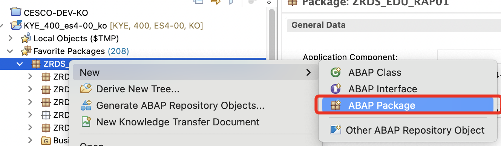

# RAP - 시나리오 2 : Custom Entity

###   

### 1\. 먼저 RAP 관련 개발오브젝트를 하나로 묶어서 관리하기 위해서 개발패키지를 하나 생성한다.

  

  

  

### 2\. Custom Entity를 생성한다.

- 화면에 리스트를 뿌리는 경우 해당 리스트에 필요한 필드 및 필터로 사용할 필드를 고려하여 생성한다.

  

  

  

  

  

  

  

다음과 같이 소스를 작성한다.

- ZRDS\_CL\_CUSTOM01은 아직 생성이 안되어 있지만 활성화시 오류는 발생하지 않는다

```
@EndUserText.label: 'Custom Entity - 판매오더아이템리스트'
@ObjectModel.query.implementedBy: 'ABAP:ZRDS_CL_CUSTOM01'
define custom entity ZRDS_C_CUSTOM01
{     
      @EndUserText.label: '판매오더아이템키'
      @EndUserText.quickInfo: '판매오더아이템키'
  key SalesOrderItemId    : sysuuid_x16;

      @EndUserText.label: '판매오더키'
      @EndUserText.quickInfo: '판매오더키'
      SalesOrderId        : sysuuid_x16;

      @EndUserText.label: '판매오더'
      @EndUserText.quickInfo: '판매오더'
      SalesOrder          : vbeln;

      @EndUserText.label: '아이템순'
      @EndUserText.quickInfo: '아이템순'
      SalesOrderItem      : posnr;

      @EndUserText.label: '오더유형'
      @EndUserText.quickInfo: '오더유형'
      SalesOrderType      : auart;

      @EndUserText.label: '판매처'
      @EndUserText.quickInfo: '판매처'
      SoldToParty         : kunnr;

      @EndUserText.label: '판매처명'
      @EndUserText.quickInfo: '판매처명'
      SoldToPartyName     : name1_gp;

      @EndUserText.label: '제품'
      @EndUserText.quickInfo: '제품'
      Product             : matnr;
      
      @EndUserText.label: '제품명'
      @EndUserText.quickInfo: '제품명'
      ProductName         : maktx;

      @EndUserText.label: '제품수량'
      @EndUserText.quickInfo: '제품수량'
      @Semantics.quantity.unitOfMeasure: 'OrderQuantityUnit'
      OrderQuantity       : kwmeng;

      @EndUserText.label: '단위'
      @EndUserText.quickInfo: '단위'
      OrderQuantityUnit   : vrkme;

      @Semantics.amount.currencyCode: 'TransactionCurrency'
      @EndUserText.label: '금액'
      @EndUserText.quickInfo: '금액'
      NetAmount           : netwr_ap;
      
      @EndUserText.label: '통화'
      @EndUserText.quickInfo: '통화'
      TransactionCurrency : waerk;
}
```

  

### 3\. Custom Entity에서 발생하는 예외에 대한 예외 클래스를 다음과 같이 생성한다.

- **CX\_RAP\_QUERY\_PROVIDER** 상속받아 생성

  

  

소스는 별다른 로직이 없이 작성하여 사용한다.

```
CLASS zrds_cx_custom DEFINITION
  PUBLIC
  INHERITING FROM cx_rap_query_provider
  FINAL
  CREATE PUBLIC .

  PUBLIC SECTION.

    METHODS constructor
      IMPORTING
        !textid   LIKE if_t100_message=>t100key OPTIONAL
        !previous LIKE previous OPTIONAL .
  PROTECTED SECTION.
  PRIVATE SECTION.
ENDCLASS.

CLASS zrds_cx_custom IMPLEMENTATION.

  METHOD constructor ##ADT_SUPPRESS_GENERATION.
    CALL METHOD super->constructor
      EXPORTING
        previous = previous.
    CLEAR me->textid.
    IF textid IS INITIAL.
      if_t100_message~t100key = if_t100_message=>default_textid.
    ELSE.
      if_t100_message~t100key = textid.
    ENDIF.
  ENDMETHOD.
ENDCLASS.
```

  

### 4\. 기본데이터를 가져오는 CDS를 아래와 같이 작성한다.

```
@AbapCatalog.viewEnhancementCategory: [#NONE]
@AccessControl.authorizationCheck: #NOT_REQUIRED
@EndUserText.label: '판매오더 아이템'
@Metadata.ignorePropagatedAnnotations: false
@ObjectModel.usageType:{
  serviceQuality: #X,
  sizeCategory: #S,
  dataClass: #MIXED
}
define view entity ZRDS_I_SALESORDERITEM
  as select from ZSD_I_SALESORDERITEM
{
  key SalesOrderItemId,
  
      SalesOrderId,
      
      _Head.SalesOrder,
      
      SalesOrderItem,
      
      _Head.SalesOrderType,
      
      _Head._SoldToParty.Customer as SoldToParty,
      
      _Head._SoldToParty.Name     as SoldToPartyName,
      
      _Product.Product,
      
      _Product._Text[ 1:Language=$session.system_language ].ProductName,
      
      OrderQuantity,
      
      OrderQuantityUnit,
      
      NetAmount,
      
      TransactionCurrency
}
```

  

### 5\. Custom Entity의 데이터를 처리하는 함수를 생성한다.

- IF\_RAP\_QUERY\_PROVIDER 상속

  

  

  

  

```
CLASS zrds_cl_custom01 DEFINITION
  PUBLIC
  FINAL
  CREATE PUBLIC .

  PUBLIC SECTION.

    INTERFACES if_rap_query_provider .
  PROTECTED SECTION.
  PRIVATE SECTION.
ENDCLASS.


CLASS zrds_cl_custom01 IMPLEMENTATION.


  METHOD if_rap_query_provider~select.

    CHECK io_request->is_data_requested( ).

    """"""""""""""""""""""""""""""""""""""""""""""""""""""""""""""""""
    " 요청값 처리
    """"""""""""""""""""""""""""""""""""""""""""""""""""""""""""""""""
    TRY.
        DATA(lt_filter) = io_request->get_filter( )->get_as_ranges( ).
      CATCH cx_root INTO DATA(lcx_exception).
        DATA(lo_exception)          = cl_message_helper=>get_latest_t100_exception( lcx_exception ).
        DATA(lo_exception_t100_key) = cl_message_helper=>get_latest_t100_exception( lcx_exception )->t100key.

        RAISE EXCEPTION TYPE zrds_cx_custom
          EXPORTING
            textid = VALUE scx_t100key(
            msgid = lo_exception_t100_key-msgid
            msgno = lo_exception_t100_key-msgno
            attr1 = lo_exception_t100_key-attr1
            attr2 = lo_exception_t100_key-attr2
            attr3 = lo_exception_t100_key-attr3
            attr4 = lo_exception_t100_key-attr4 ).
    ENDTRY.

    DATA(lv_top)     = io_request->get_paging( )->get_page_size( ).
    DATA(lv_skip)    = io_request->get_paging( )->get_offset( ).
    DATA(lt_fields)  = io_request->get_requested_elements( ).
    DATA(lt_sort)    = io_request->get_sort_elements( ).

    """"""""""""""""""""""""""""""""""""""""""""""""""""""""""""""""""
    " 필터생성
    """"""""""""""""""""""""""""""""""""""""""""""""""""""""""""""""""
    DATA : ls_filter_salesorder     LIKE LINE OF lt_filter, " 판매오더
           ls_filter_salesordertype LIKE LINE OF lt_filter, " 판매오더유형
           ls_filter_soldtoparty    LIKE LINE OF lt_filter, " 판매처
           ls_filter_product        LIKE LINE OF lt_filter. " 제품

    CLEAR : ls_filter_salesorder,
            ls_filter_salesordertype,
            ls_filter_soldtoparty,
            ls_filter_product.

    LOOP AT lt_filter INTO DATA(ls_filter).
      CASE ls_filter-name.
        WHEN 'SALESORDER'.
          ls_filter_salesorder      = ls_filter.
        WHEN 'SALESORDERTYPE'.
          ls_filter_salesordertype  = ls_filter.
        WHEN 'SOLDTOPARTY'.
          ls_filter_soldtoparty     = ls_filter.
        WHEN 'PRODUCT'.
          ls_filter_product         = ls_filter.
      ENDCASE.
    ENDLOOP.

    """"""""""""""""""""""""""""""""""""""""""""""""""""""""""""""""""
    " PAGING 처리
    """"""""""""""""""""""""""""""""""""""""""""""""""""""""""""""""""
    DATA : lv_orderby TYPE string.

    LOOP AT lt_sort INTO DATA(ls_sort).
      IF ls_sort-descending = abap_true.
        IF lv_orderby IS NOT INITIAL.
          lv_orderby = |{ lv_orderby }, { ls_sort-element_name } DESCENDING|.
        ELSE.
          lv_orderby = |{ ls_sort-element_name } DESCENDING|.
        ENDIF.
      ELSE.
        IF lv_orderby IS NOT INITIAL.
          lv_orderby = |{ lv_orderby }, { ls_sort-element_name } ASCENDING|.
        ELSE.
          lv_orderby = |{ ls_sort-element_name } ASCENDING|.
        ENDIF.
      ENDIF.
    ENDLOOP.

    IF lv_orderby IS INITIAL.
      lv_orderby = |SALESORDERID|.
    ENDIF.

    """"""""""""""""""""""""""""""""""""""""""""""""""""""""""""""""""
    " 데이터검색
    """"""""""""""""""""""""""""""""""""""""""""""""""""""""""""""""""
    DATA : lt_result TYPE STANDARD TABLE OF zrds_c_custom01 WITH DEFAULT KEY.

    SELECT FROM ZRDS_I_SALESORDERITEM
    FIELDS salesorderitemid
         , salesorderid
         , salesorder
         , salesorderitem
         , salesordertype
         , soldtoparty
         , soldtopartyname
         , product
         , productname
         , orderquantity
         , orderquantityunit
         , netamount
         , transactioncurrency
    WHERE salesorder        IN @ls_filter_salesorder-range
      AND salesordertype    IN @ls_filter_salesordertype-range
      AND SoldToParty       IN @ls_filter_soldtoparty-range
      AND product           IN @ls_filter_product-range
    ORDER BY (lv_orderby)
    INTO CORRESPONDING FIELDS OF TABLE @lt_result
    OFFSET @lv_skip UP TO @lv_top ROWS.

    """"""""""""""""""""""""""""""""""""""""""""""""""""""""""""""""""
    " 결과값
    """"""""""""""""""""""""""""""""""""""""""""""""""""""""""""""""""
    io_response->set_data( lt_result ).
    io_response->set_total_number_of_records( lines( lt_result )  ).

  ENDMETHOD.
ENDCLASS.
```

  

### 5\. 화면에 출력하기 위해서 UI 어노테이션 작업을 수행한다.

- Custom 엔터티는 Metadata Extension을 만들지 못하므로 CDS 자체적으로 어노테이션을 추가한다.

  

```
@EndUserText.label: 'Custom Entity - 판매오더아이템리스트'
@ObjectModel.query.implementedBy: 'ABAP:ZRDS_CL_CUSTOM01'
define custom entity ZRDS_C_CUSTOM01
{     
      @UI.hidden: true
      @EndUserText.label: '판매오더아이템키'
      @EndUserText.quickInfo: '판매오더아이템키'
  key SalesOrderItemId    : sysuuid_x16;

      @UI.hidden: true
      @EndUserText.label: '판매오더키'
      @EndUserText.quickInfo: '판매오더키'
      SalesOrderId        : sysuuid_x16;

      @UI.selectionField: [{ position: 10 }]
      @UI.lineItem: [{ position: 10 }]
      @EndUserText.label: '판매오더'
      @EndUserText.quickInfo: '판매오더'
      SalesOrder          : vbeln;

      @UI.lineItem: [{ position: 20 }]
      @EndUserText.label: '아이템순'
      @EndUserText.quickInfo: '아이템순'
      SalesOrderItem      : posnr;

      @UI.selectionField: [{ position: 20 }]
      @UI.lineItem: [{ position: 30 }]
      @EndUserText.label: '오더유형'
      @EndUserText.quickInfo: '오더유형'
      SalesOrderType      : auart;

      @UI.selectionField: [{ position: 30 }]
      @UI.lineItem: [{ position: 40 }]
      @EndUserText.label: '판매처'
      @EndUserText.quickInfo: '판매처'
      SoldToParty         : kunnr;

      @UI.lineItem: [{ position: 50 }]
      @EndUserText.label: '판매처명'
      @EndUserText.quickInfo: '판매처명'
      SoldToPartyName     : name1_gp;

      @UI.selectionField: [{ position: 40 }]
      @UI.lineItem: [{ position: 60 }]
      @EndUserText.label: '제품'
      @EndUserText.quickInfo: '제품'
      Product             : matnr;
      
      @UI.lineItem: [{ position: 70 }]
      @EndUserText.label: '제품명'
      @EndUserText.quickInfo: '제품명'
      ProductName         : maktx;

      @UI.lineItem: [{ position: 80 }]
      @EndUserText.label: '제품수량'
      @EndUserText.quickInfo: '제품수량'
      @Semantics.quantity.unitOfMeasure: 'OrderQuantityUnit'
      OrderQuantity       : kwmeng;

      @UI.lineItem: [{ position: 90 }]
      @EndUserText.label: '단위'
      @EndUserText.quickInfo: '단위'
      OrderQuantityUnit   : vrkme;

      @UI.lineItem: [{ position: 100 }]
      @Semantics.amount.currencyCode: 'TransactionCurrency'
      @EndUserText.label: '금액'
      @EndUserText.quickInfo: '금액'
      NetAmount           : netwr_ap;
      
      @UI.lineItem: [{ position: 110 }]
      @EndUserText.label: '통화'
      @EndUserText.quickInfo: '통화'
      TransactionCurrency : waerk;
}
```

  

### 6\. Service Definition을 생성한다.

  

  

  

```
@EndUserText.label: '판매오더아이템'
define service ZRDS_SD_CUSTOM01 {
  expose ZRDS_C_CUSTOM01;
}
```

  

### 7\. Service Binding을 생성한다.

  

  

  

  

  

활성화를 한다.

  

  

T-Code : /IWFND/V4\_ADMIN 를 통해서 Publish를 한다.

  

### 8\. “Preview”를 통해서 테스트를 한다.

  

  

  

